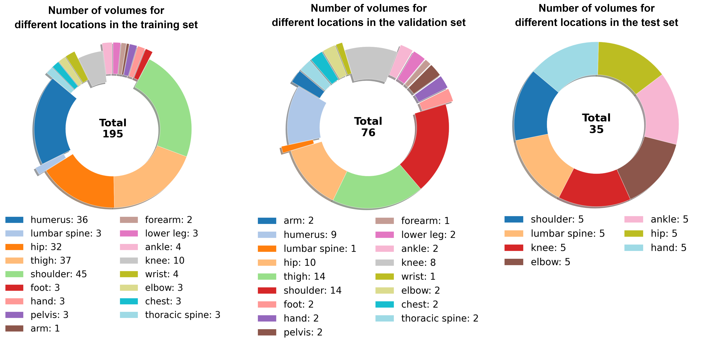

# SegmentAnyBone: A Universal Model that Segments Any Bone at Any Location on MRI

[](https://arxiv.org/abs/2401.12974)


SegmentAnyBone is a foundational model based bone segmentation algorithm adapted from [Segment Anything Model (SAM)](https://pages.github.com/](https://github.com/facebookresearch/segment-anything)https://github.com/facebookresearch/segment-anything) for MRI scans. It is able to segment bones in the following **17 body parts**:

**`Humerus`**  |  **`Thoracic Spine`**   |  **`Lumbar Spine`**   | **`Forearm`** | **`Pelvis`** |  **`Hand`** |  **`Lower Leg`** 

 **`Shoulder`** | **`Chest`**  |  **`Arm`**   |  **`Elbow`**   | **`Hip`** | **`Wrist`** |  **`Thigh`** |  **`Knee`** |  **`Foot`** |  **`Ankle`** 


## Dataset



## Installation & Usage

You can clone the repository and install required packages by running following commands:
```
git clone https://github.com/mazurowski-lab/SegmentAnyBone.git
cd SegmentAnybone; pip install -r requirements.txt
```

After cloning the repository, you should put your 3D MRI volume in `/images`, and your ground truth mask in `/masks` folder if you want to evaluate the segmentation performance of SegmentAnyBone. If you need to segment 3D volume instead of 1 slice you can see the 3D segmentation mask under `/predicted_masks` after you run **_predictAndEvaluateVolume()_** function. [This notebook](demo.ipynb)  will guide you to use SegmentAnyBone in a slice-based and volume-based manner thanks to following **predictSlice()_**, **evaluateSlicePrediction()_**, and **_predictAndEvaluateVolume()_** functions: 

```python
ori_img, predictedSliceMask, atten_map = predictSlice(
    image_name = '5.nii.gz', 
    lower_percentile = 1,
    upper_percentile = 99,
    slice_id = 18, # slice number
    attention_enabled = True, # if you want to use the depth attention
    post_processing_enabled = False
)

msk_gt, dsc_gt = evaluateSlicePrediction(
    mask_pred = predictedSliceMask, 
    mask_name = '5.nrrd', 
    slice_id = 18
)
```

```python
predictAndEvaluateVolume(
    image_name = '5.nii.gz', 
    mask_name = '5.nrrd',
    lower_percentile = 1, 
    upper_percentile = 99
)
```
## License

The model is licensed under the [CC BY-NC 4.0](https://creativecommons.org/licenses/by-nc/4.0/)

## Citation

```
@misc{gu2024segmentanybone,
      title={SegmentAnyBone: A Universal Model that Segments Any Bone at Any Location on MRI}, 
      author={Hanxue Gu and Roy Colglazier and Haoyu Dong and Jikai Zhang and Yaqian Chen and Zafer Yildiz and Yuwen Chen and Lin Li and Jichen Yang and Jay Willhite and Alex M. Meyer and Brian Guo and Yashvi Atul Shah and Emily Luo and Shipra Rajput and Sally Kuehn and Clark Bulleit and Kevin A. Wu and Jisoo Lee and Brandon Ramirez and Darui Lu and Jay M. Levin and Maciej A. Mazurowski},
      year={2024},
      eprint={2401.12974},
      archivePrefix={arXiv},
      primaryClass={eess.IV}
```
}
